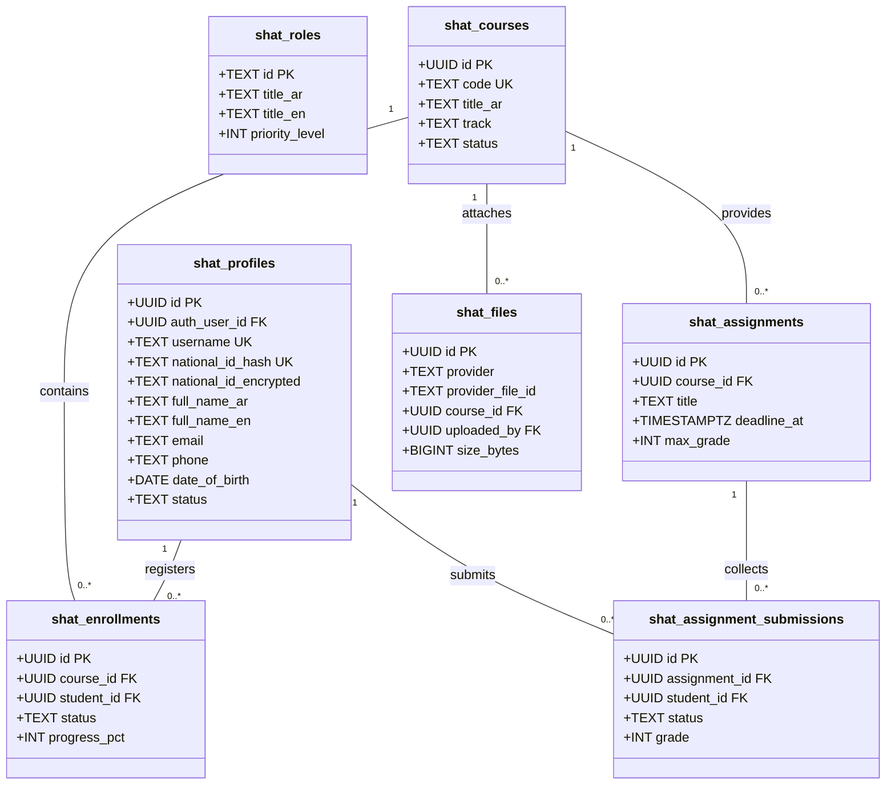

# SHAT Platform — Phase 1 Database Schema Specification
**شركة شات للتنمية والتطوير وأكاديمية شات**
*Comprehensive Normalized Relational Schema Specification (PostgreSQL / Supabase)*
*Date: 2026-09-25 | Status: Complete & Deterministic*

---

## 1. Schema Overview & Domain Separation

The database schema is strictly partitioned into cohesive domains under the `public` schema with the protected namespace prefix `shat_`. Every table enforces strong typing, explicit primary keys, cascading referential integrity, check constraints, default timestamps, and row-level audit fields.

---

## 2. Table Specifications by Domain

### 2.1 Identity, Users & Profile Domain

#### `shat_profiles` (Application Master Profile)
* **Description:** Represents the verified identity of all participants (students, teachers, staff, administrators). Linked 1:1 with Supabase `auth.users`.
* **Columns:**
  * `id`: `UUID PRIMARY KEY DEFAULT gen_random_uuid()`
  * `auth_user_id`: `UUID UNIQUE REFERENCES auth.users(id) ON DELETE CASCADE`
  * `username`: `TEXT UNIQUE NOT NULL` (Matches National ID or system identifier)
  * `national_id_hash`: `TEXT UNIQUE NOT NULL` (HMAC-SHA256 salted hash for duplicate checking)
  * `national_id_encrypted`: `TEXT NOT NULL` (AES-256-GCM ciphertext, accessible only by Super Admin)
  * `full_name_ar`: `TEXT NOT NULL`
  * `full_name_en`: `TEXT NOT NULL`
  * `email`: `TEXT NOT NULL`
  * `phone`: `TEXT NOT NULL`
  * `whatsapp_number`: `TEXT`
  * `date_of_birth`: `DATE NOT NULL`
  * `avatar_url`: `TEXT`
  * `status`: `TEXT DEFAULT 'pending_profile' CHECK (status IN ('pending_profile', 'active', 'suspended', 'deactivated'))`
  * `created_at`: `TIMESTAMPTZ DEFAULT timezone('utc'::text, now()) NOT NULL`
  * `updated_at`: `TIMESTAMPTZ DEFAULT timezone('utc'::text, now()) NOT NULL`

#### `shat_student_profiles`
* **Columns:** `id (UUID PK FK shat_profiles)`, `educational_level (TEXT)`, `organization (TEXT)`, `job_title (TEXT)`, `specialization (TEXT)`, `emergency_contact (TEXT)`.

#### `shat_teacher_profiles`
* **Columns:** `id (UUID PK FK shat_profiles)`, `title_prefix (TEXT)`, `bio_ar (TEXT)`, `bio_en (TEXT)`, `academic_degrees (JSONB)`, `years_of_experience (INT)`, `specializations (TEXT[])`, `is_verified (BOOLEAN DEFAULT false)`.

#### `shat_employee_profiles`
* **Columns:** `id (UUID PK FK shat_profiles)`, `department (TEXT)`, `job_title (TEXT)`, `reports_to (UUID FK shat_profiles)`, `office_location (TEXT)`.

---

### 2.2 Roles & Granular Permissions Domain

#### `shat_roles`
* **Predefined Values:** `super_admin`, `admin`, `employee`, `teacher`, `student`, `visitor`.
* **Columns:**
  * `id`: `TEXT PRIMARY KEY` (Role slug, e.g. `'super_admin'`)
  * `title_ar`: `TEXT NOT NULL`
  * `title_en`: `TEXT NOT NULL`
  * `description`: `TEXT`
  * `priority_level`: `INT NOT NULL DEFAULT 100`

#### `shat_permissions`
* **Columns:**
  * `id`: `TEXT PRIMARY KEY` (e.g. `'courses.create'`, `'grades.view'`)
  * `category`: `TEXT NOT NULL` (e.g. `'academic'`, `'content'`, `'admin'`)
  * `description_ar`: `TEXT`
  * `description_en`: `TEXT`

#### `shat_role_permissions`
* **Columns:** `role_id (TEXT FK shat_roles)`, `permission_id (TEXT FK shat_permissions)`, `PRIMARY KEY (role_id, permission_id)`.

#### `shat_user_roles`
* **Description:** Enables multi-role capability for any user (e.g., a Teacher who is also an Admin).
* **Columns:** `user_id (UUID FK shat_profiles)`, `role_id (TEXT FK shat_roles)`, `assigned_at (TIMESTAMPTZ)`, `assigned_by (UUID FK shat_profiles)`, `PRIMARY KEY (user_id, role_id)`.

#### `shat_user_permissions` (Granular User-Level Overrides)
* **Columns:** `user_id (UUID FK shat_profiles)`, `permission_id (TEXT FK shat_permissions)`, `is_granted (BOOLEAN DEFAULT true)`, `PRIMARY KEY (user_id, permission_id)`.

---

### 2.3 Academy, Courses & Academic Hierarchy Domain

#### `shat_courses`
* **Columns:**
  * `id`: `UUID PRIMARY KEY DEFAULT gen_random_uuid()`
  * `code`: `TEXT UNIQUE NOT NULL` (e.g., `'SHAT-CHS-2026'`)
  * `title_ar`: `TEXT NOT NULL`
  * `title_en`: `TEXT`
  * `track`: `TEXT NOT NULL` (e.g., `'humanitarian'`, `'protection'`, `'consulting'`)
  * `category`: `TEXT DEFAULT 'diploma'`
  * `level`: `TEXT DEFAULT 'advanced'`
  * `duration_weeks`: `INT`
  * `credit_hours`: `INT`
  * `overview_ar`: `TEXT`
  * `overview_en`: `TEXT`
  * `learning_outcomes`: `JSONB DEFAULT '[]'::jsonb`
  * `cover_image_url`: `TEXT`
  * `status`: `TEXT DEFAULT 'draft' CHECK (status IN ('draft', 'published', 'active', 'archived'))`
  * `created_at`: `TIMESTAMPTZ DEFAULT timezone('utc'::text, now()) NOT NULL`

#### `shat_course_teachers` (Multi-Teacher Support)
* **Columns:**
  * `course_id`: `UUID REFERENCES shat_courses(id) ON DELETE CASCADE`
  * `teacher_id`: `UUID REFERENCES shat_profiles(id) ON DELETE CASCADE`
  * `role_in_course`: `TEXT DEFAULT 'LEAD_TEACHER' CHECK (role_in_course IN ('LEAD_TEACHER', 'CO_TEACHER', 'ASSISTANT_TEACHER'))`
  * `PRIMARY KEY (course_id, teacher_id)`

#### `shat_course_sections` (Units / Chapters)
* **Columns:** `id (UUID PK)`, `course_id (UUID FK shat_courses)`, `title_ar (TEXT)`, `title_en (TEXT)`, `sort_order (INT DEFAULT 1)`.

#### `shat_course_lessons`
* **Columns:** `id (UUID PK)`, `section_id (UUID FK shat_course_sections)`, `title_ar (TEXT)`, `title_en (TEXT)`, `content_rich_text (TEXT)`, `duration_minutes (INT)`, `sort_order (INT DEFAULT 1)`.

#### `shat_course_materials`
* **Columns:**
  * `id`: `UUID PRIMARY KEY DEFAULT gen_random_uuid()`
  * `course_id`: `UUID REFERENCES shat_courses(id) ON DELETE CASCADE`
  * `lesson_id`: `UUID REFERENCES shat_course_lessons(id) ON DELETE SET NULL`
  * `title`: `TEXT NOT NULL`
  * `file_id`: `UUID REFERENCES shat_files(id) ON DELETE RESTRICT`
  * `is_mandatory`: `BOOLEAN DEFAULT false`
  * `downloads_count`: `INT DEFAULT 0`

#### `shat_course_announcements`
* **Columns:** `id (UUID PK)`, `course_id (UUID FK shat_courses)`, `title (TEXT)`, `body (TEXT)`, `author_id (UUID FK shat_profiles)`, `is_pinned (BOOLEAN DEFAULT false)`, `created_at (TIMESTAMPTZ)`.

---

### 2.4 Enrollments & Admissions Domain

#### `shat_enrollments`
* **Columns:**
  * `id`: `UUID PRIMARY KEY DEFAULT gen_random_uuid()`
  * `course_id`: `UUID REFERENCES shat_courses(id) ON DELETE CASCADE`
  * `student_id`: `UUID REFERENCES shat_profiles(id) ON DELETE CASCADE`
  * `status`: `TEXT DEFAULT 'pending' CHECK (status IN ('pending', 'approved', 'active', 'suspended', 'completed', 'withdrawn', 'rejected'))`
  * `progress_percentage`: `INT DEFAULT 0 CHECK (progress_percentage BETWEEN 0 AND 100)`
  * `attendance_rate`: `INT DEFAULT 0 CHECK (attendance_rate BETWEEN 0 AND 100)`
  * `enrolled_at`: `TIMESTAMPTZ DEFAULT timezone('utc'::text, now()) NOT NULL`
  * `approved_by`: `UUID REFERENCES shat_profiles(id)`
  * `approved_at`: `TIMESTAMPTZ`
  * `rejection_reason`: `TEXT`
  * **Constraint:** `UNIQUE (course_id, student_id)` — Prevents duplicate enrollments.

---

### 2.5 Assignments, Examinations & Gradebook Domain

#### `shat_assignments`
* **Columns:** `id (UUID PK)`, `course_id (UUID FK shat_courses)`, `title (TEXT)`, `instructions (TEXT)`, `deadline_at (TIMESTAMPTZ)`, `max_grade (INT DEFAULT 100)`, `status (TEXT DEFAULT 'draft' CHECK (status IN ('draft', 'published', 'closed')))`

#### `shat_assignment_submissions`
* **Columns:**
  * `id`: `UUID PRIMARY KEY DEFAULT gen_random_uuid()`
  * `assignment_id`: `UUID REFERENCES shat_assignments(id) ON DELETE CASCADE`
  * `student_id`: `UUID REFERENCES shat_profiles(id) ON DELETE CASCADE`
  * `submission_text`: `TEXT`
  * `status`: `TEXT DEFAULT 'submitted' CHECK (status IN ('draft', 'submitted', 'late', 'graded', 'returned'))`
  * `grade`: `INT CHECK (grade >= 0)`
  * `instructor_feedback`: `TEXT`
  * `graded_by`: `UUID REFERENCES shat_profiles(id)`
  * `graded_at`: `TIMESTAMPTZ`
  * `submitted_at`: `TIMESTAMPTZ DEFAULT timezone('utc'::text, now()) NOT NULL`
  * **Constraint:** `UNIQUE (assignment_id, student_id)`

#### `shat_assignment_submission_files`
* **Columns:** `submission_id (UUID FK shat_assignment_submissions)`, `file_id (UUID FK shat_files)`, `PRIMARY KEY (submission_id, file_id)`.

#### `shat_exams`
* **Columns:** `id (UUID PK)`, `course_id (UUID FK shat_courses)`, `title (TEXT)`, `duration_minutes (INT DEFAULT 60)`, `start_window (TIMESTAMPTZ)`, `end_window (TIMESTAMPTZ)`, `max_attempts (INT DEFAULT 1)`, `passing_grade (INT DEFAULT 60)`.

#### `shat_exam_questions`
* **Columns:** `id (UUID PK)`, `exam_id (UUID FK shat_exams)`, `question_type (TEXT CHECK (question_type IN ('mcq', 'true_false', 'short_answer', 'essay', 'file')))`, `prompt (TEXT)`, `options (JSONB)`, `correct_answer_hash (TEXT)`, `points (INT DEFAULT 10)`, `sort_order (INT)`.

#### `shat_exam_attempts`
* **Columns:** `id (UUID PK)`, `exam_id (UUID FK shat_exams)`, `student_id (UUID FK shat_profiles)`, `attempt_number (INT DEFAULT 1)`, `score (INT)`, `passed (BOOLEAN)`, `started_at (TIMESTAMPTZ)`, `submitted_at (TIMESTAMPTZ)`.

#### `shat_grade_items` & `shat_grades`
* **Columns:** `shat_grade_items` maps courses to evaluation components (Assignments, Quizzes, Midterms, Final Exam, Attendance) with designated weight percentages. `shat_grades` records normalized scores.

---

### 2.6 Storage & File Metadata Domain (Google Drive Layer)

#### `shat_files`
* **Columns:**
  * `id`: `UUID PRIMARY KEY DEFAULT gen_random_uuid()`
  * `provider`: `TEXT DEFAULT 'google_drive' NOT NULL` (Supports future providers)
  * `provider_file_id`: `TEXT NOT NULL` (Google Drive File ID)
  * `folder_id`: `TEXT` (Google Drive Folder ID)
  * `name`: `TEXT NOT NULL`
  * `mime_type`: `TEXT NOT NULL`
  * `size_bytes`: `BIGINT NOT NULL`
  * `course_id`: `UUID REFERENCES shat_courses(id) ON DELETE SET NULL`
  * `uploaded_by`: `UUID REFERENCES shat_profiles(id) ON DELETE SET NULL`
  * `access_tier`: `TEXT DEFAULT 'enrolled_students' CHECK (access_tier IN ('public', 'enrolled_students', 'course_teachers', 'staff_only'))`
  * `created_at`: `TIMESTAMPTZ DEFAULT timezone('utc'::text, now()) NOT NULL`

---

### 2.7 Corporate CMS & Website Domain

#### `shat_posts`
* **Columns:** `id (UUID PK)`, `slug (TEXT UNIQUE)`, `title_ar (TEXT)`, `title_en (TEXT)`, `content_rich_text (TEXT)`, `excerpt_ar (TEXT)`, `cover_image_url (TEXT)`, `category (TEXT)`, `tags (TEXT[])`, `status (TEXT DEFAULT 'draft' CHECK (status IN ('draft', 'preview', 'published', 'archived')))`, `published_at (TIMESTAMPTZ)`, `created_by (UUID FK shat_profiles)`.

#### `shat_projects`
* **Columns:** `id (UUID PK)`, `slug (TEXT UNIQUE)`, `title_ar (TEXT)`, `client_name (TEXT)`, `category (TEXT)`, `timeline (TEXT)`, `description_ar (TEXT)`, `outcomes (JSONB)`, `cover_image_url (TEXT)`, `gallery_urls (TEXT[])`, `status (TEXT DEFAULT 'published')`.

#### `shat_consultations` & `shat_certificate_verifications`
* Migrated from previous schema with verified RLS policies and full contact tracking.

#### `shat_site_settings`
* **Columns:** `key (TEXT PRIMARY KEY)`, `value (JSONB NOT NULL)`, `description (TEXT)`, `updated_at (TIMESTAMPTZ)`, `updated_by (UUID FK shat_profiles)`.

---

### 2.8 Audit & Telemetry Domain

#### `shat_audit_logs`
* **Columns:**
  * `id`: `UUID PRIMARY KEY DEFAULT gen_random_uuid()`
  * `actor_id`: `UUID REFERENCES shat_profiles(id) ON DELETE SET NULL`
  * `actor_role`: `TEXT NOT NULL`
  * `action`: `TEXT NOT NULL` (e.g. `'COURSE_CREATED'`, `'GRADE_OVERRIDDEN'`)
  * `entity_type`: `TEXT NOT NULL` (e.g. `'course'`, `'submission'`, `'user'`)
  * `entity_id`: `TEXT NOT NULL`
  * `ip_address`: `INET`
  * `user_agent`: `TEXT`
  * `payload_before`: `JSONB`
  * `payload_after`: `JSONB`
  * `created_at`: `TIMESTAMPTZ DEFAULT timezone('utc'::text, now()) NOT NULL`
