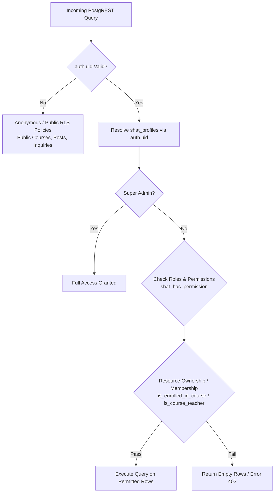

# SHAT Platform — Phase 1 Row Level Security (RLS) Model
**شركة شات للتنمية والتطوير وأكاديمية شات**
*Security Policy Architecture, Helper Functions & Access Isolation Model*
*Date: 2026-09-25 | Status: Complete & Deterministic*

---

## 1. RLS Defense-in-Depth Architecture

Row Level Security (RLS) is the central security enforcement boundary in the SHAT Platform. Client-side button hiding is treated strictly as cosmetic UX; all read, insert, update, and delete actions are verified by PostgreSQL at the engine level.



---

## 2. PostgreSQL Security Helper Functions

To ensure RLS policies remain clean, performant, and completely free of recursive loops, we define dedicated, optimized helper functions with `SECURITY DEFINER` and strict `SET search_path = public`:

### 2.1 `shat_get_profile_id()`
Resolves the internal profile UUID from the active Supabase JWT subject (`auth.uid()`):
```sql
CREATE OR REPLACE FUNCTION public.shat_get_profile_id()
RETURNS UUID
LANGUAGE sql
STABLE
SECURITY DEFINER
SET search_path = public
AS $$
  SELECT id FROM public.shat_profiles WHERE auth_user_id = auth.uid() LIMIT 1;
$$;
```

### 2.2 `shat_has_role(required_role TEXT)`
Checks whether the authenticated user holds a specific system role:
```sql
CREATE OR REPLACE FUNCTION public.shat_has_role(required_role TEXT)
RETURNS BOOLEAN
LANGUAGE sql
STABLE
SECURITY DEFINER
SET search_path = public
AS $$
  SELECT EXISTS (
    SELECT 1 
    FROM public.shat_user_roles ur
    JOIN public.shat_profiles p ON p.id = ur.user_id
    WHERE p.auth_user_id = auth.uid() 
      AND (ur.role_id = required_role OR ur.role_id = 'super_admin')
  );
$$;
```

### 2.3 `shat_has_permission(required_perm TEXT)`
Validates whether the user holds a granular permission via their assigned roles or direct user grant:
```sql
CREATE OR REPLACE FUNCTION public.shat_has_permission(required_perm TEXT)
RETURNS BOOLEAN
LANGUAGE sql
STABLE
SECURITY DEFINER
SET search_path = public
AS $$
  SELECT EXISTS (
    SELECT 1 
    FROM public.shat_profiles p
    WHERE p.auth_user_id = auth.uid()
      AND (
        -- 1. Super Admin bypass
        EXISTS (SELECT 1 FROM public.shat_user_roles ur WHERE ur.user_id = p.id AND ur.role_id = 'super_admin')
        -- 2. Direct user grant
        OR EXISTS (SELECT 1 FROM public.shat_user_permissions up WHERE up.user_id = p.id AND up.permission_id = required_perm AND up.is_granted = true)
        -- 3. Role-based grant
        OR EXISTS (
          SELECT 1 
          FROM public.shat_user_roles ur
          JOIN public.shat_role_permissions rp ON rp.role_id = ur.role_id
          WHERE ur.user_id = p.id AND rp.permission_id = required_perm
        )
      )
  );
$$;
```

### 2.4 `shat_is_enrolled_in_course(course_uuid UUID)`
Verifies active academic enrollment:
```sql
CREATE OR REPLACE FUNCTION public.shat_is_enrolled_in_course(course_uuid UUID)
RETURNS BOOLEAN
LANGUAGE sql
STABLE
SECURITY DEFINER
SET search_path = public
AS $$
  SELECT EXISTS (
    SELECT 1 
    FROM public.shat_enrollments e
    JOIN public.shat_profiles p ON p.id = e.student_id
    WHERE p.auth_user_id = auth.uid() 
      AND e.course_id = course_uuid
      AND e.status IN ('active', 'completed')
  );
$$;
```

### 2.5 `shat_is_course_teacher(course_uuid UUID)`
Validates whether the authenticated instructor is assigned to the specified course:
```sql
CREATE OR REPLACE FUNCTION public.shat_is_course_teacher(course_uuid UUID)
RETURNS BOOLEAN
LANGUAGE sql
STABLE
SECURITY DEFINER
SET search_path = public
AS $$
  SELECT EXISTS (
    SELECT 1 
    FROM public.shat_course_teachers ct
    JOIN public.shat_profiles p ON p.id = ct.teacher_id
    WHERE p.auth_user_id = auth.uid() 
      AND ct.course_id = course_uuid
  );
$$;
```

---

## 3. RLS Matrix by Entity

### 3.1 `shat_profiles`
* **SELECT (Public / Anonymous):** Only public fields via the view `shat_public_profiles` (full name, avatar, bio).
* **SELECT (Self):** User can read their complete record:
  ```sql
  CREATE POLICY "shat_profiles_select_self" ON public.shat_profiles
    FOR SELECT TO authenticated
    USING (auth_user_id = auth.uid() OR shat_has_role('super_admin') OR shat_has_permission('users.view'));
  ```
* **UPDATE (Self):** User can update their name and avatar, but **cannot** alter `username`, `national_id_hash`, or `status`:
  ```sql
  CREATE POLICY "shat_profiles_update_self" ON public.shat_profiles
    FOR UPDATE TO authenticated
    USING (auth_user_id = auth.uid() OR shat_has_permission('users.update'))
    WITH CHECK (auth_user_id = auth.uid() OR shat_has_permission('users.update'));
  ```

---

### 3.2 `shat_courses`
* **SELECT (Public & Students):** Anyone can view published courses:
  ```sql
  CREATE POLICY "shat_courses_select_public" ON public.shat_courses
    FOR SELECT TO anon, authenticated
    USING (status IN ('published', 'active') OR shat_is_course_teacher(id) OR shat_has_permission('courses.view'));
  ```
* **INSERT/UPDATE/DELETE (Staff & Instructors):**
  ```sql
  CREATE POLICY "shat_courses_modify" ON public.shat_courses
    FOR ALL TO authenticated
    USING (shat_has_permission('courses.edit') OR shat_is_course_teacher(id))
    WITH CHECK (shat_has_permission('courses.edit') OR shat_is_course_teacher(id));
  ```

---

### 3.3 `shat_enrollments`
* **SELECT (Student Isolation):** Student can **only** inspect their own enrollments; Teachers can inspect enrollments in their courses; Admissions staff inspect all:
  ```sql
  CREATE POLICY "shat_enrollments_select" ON public.shat_enrollments
    FOR SELECT TO authenticated
    USING (
      student_id = shat_get_profile_id()
      OR shat_is_course_teacher(course_id)
      OR shat_has_permission('enrollment.manage')
    );
  ```
* **INSERT (Application Submission):** Any authenticated student can apply:
  ```sql
  CREATE POLICY "shat_enrollments_insert_self" ON public.shat_enrollments
    FOR INSERT TO authenticated
    WITH CHECK (student_id = shat_get_profile_id());
  ```

---

### 3.4 `shat_course_materials` & `shat_files`
* **SELECT (Access Gate):** Material metadata and download privileges are restricted to enrolled students, assigned teachers, or admins:
  ```sql
  CREATE POLICY "shat_materials_select_enrolled" ON public.shat_course_materials
    FOR SELECT TO authenticated
    USING (
      shat_is_enrolled_in_course(course_id)
      OR shat_is_course_teacher(course_id)
      OR shat_has_permission('courses.view')
    );
  ```

---

### 3.5 `shat_assignment_submissions` (Critical Student Data Isolation)
* **SELECT Policy:** A student can **never** see submissions belonging to other students:
  ```sql
  CREATE POLICY "shat_submissions_select" ON public.shat_assignment_submissions
    FOR SELECT TO authenticated
    USING (
      student_id = shat_get_profile_id()
      OR EXISTS (
        SELECT 1 FROM public.shat_assignments a 
        WHERE a.id = assignment_id AND (shat_is_course_teacher(a.course_id) OR shat_has_permission('assignments.grade'))
      )
    );
  ```
* **INSERT / UPDATE Policy:** Student can only submit and edit their own work:
  ```sql
  CREATE POLICY "shat_submissions_insert_self" ON public.shat_assignment_submissions
    FOR INSERT TO authenticated
    WITH CHECK (student_id = shat_get_profile_id());
  ```

---

### 3.6 `shat_grades`
* **SELECT Policy:**
  ```sql
  CREATE POLICY "shat_grades_select" ON public.shat_grades
    FOR SELECT TO authenticated
    USING (
      student_id = shat_get_profile_id()
      OR EXISTS (
        SELECT 1 FROM public.shat_grade_items gi 
        WHERE gi.id = grade_item_id AND (shat_is_course_teacher(gi.course_id) OR shat_has_permission('grades.view'))
      )
    );
  ```

---

### 3.7 `shat_audit_logs`
* **SELECT Policy:** Strictly restricted to Super Admin and Auditors:
  ```sql
  CREATE POLICY "shat_audit_select_admin" ON public.shat_audit_logs
    FOR SELECT TO authenticated
    USING (shat_has_role('super_admin') OR shat_has_permission('audit.view'));
  ```
* **INSERT Policy:** System and authenticated backend actions can append:
  ```sql
  CREATE POLICY "shat_audit_insert" ON public.shat_audit_logs
    FOR INSERT TO authenticated
    WITH CHECK (true);
  ```
* **UPDATE / DELETE Policy:** **Forbidden.** No policy defined; updates and deletes are blocked at the engine level.

---

## 4. Verification Test Battery for RLS

| Scenario | Actor | Target Resource | Expected Result | Enforcement Layer |
| :--- | :--- | :--- | :--- | :--- |
| **Cross-Student Profile Snoop** | Student A | Student B's row in `shat_profiles` | **DENIED / Empty Row** | `shat_profiles_select_self` |
| **Cross-Student Submission Snoop** | Student A | Student B's assignment submission | **DENIED / Empty Row** | `shat_submissions_select` |
| **Unenrolled Course Material Download** | Student A | Course B Material (Not Enrolled) | **DENIED (HTTP 403)** | `shat_materials_select_enrolled` |
| **Unassigned Course Teacher Modification**| Teacher A | Course B (Assigned to Teacher B) | **DENIED (0 rows updated)** | `shat_courses_modify` |
| **Employee CMS Access vs Student Snoop** | Content Editor | `shat_posts` (Draft) | **GRANTED** | `shat_has_permission('content.edit')` |
| **Employee Student Data Snooping** | Content Editor | `shat_student_profiles` | **DENIED / Empty Row** | `shat_has_permission('students.view')` |
| **Tampering with Audit Logs** | Super Admin | `DELETE FROM shat_audit_logs` | **DENIED (No DELETE Policy)** | PostgreSQL RLS Engine |
