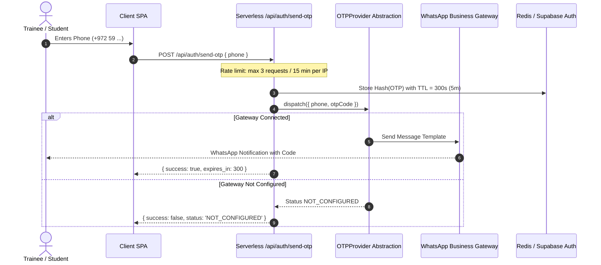

# SHAT Platform — Phase 1 Security Architecture & Hardening Model
**شركة شات للتنمية والتطوير وأكاديمية شات**
*Security Architecture, Identity Governance, National ID Shielding & Threat Defense*
*Date: 2026-09-25 | Status: Complete & Deterministic*

---

## 1. Threat Model & Security Posture

The SHAT Platform manages sensitive institutional assets: student academic transcripts, National IDs, examination contents, and private corporate files. The security architecture enforces a zero-trust model: **no client input is trusted, no database table is unshielded, and no authentication secret touches frontend code**.

```mermaid
graph LR
    subgraph Client_Defense
        XSS[DOM Sanitization & CSP]
        INPUT[Strict Type & RegEx Validation]
    end

    subgraph Transport_Defense
        TLS[TLS 1.3 Strict HTTPS]
        HSTS[HSTS Preload]
        RATE[Edge Rate Limiter<br/>Token Bucket / IP Throttling]
    end

    subgraph Application_Defense
        JWT[Short-lived JWT (15m)]
        COOKIE[HttpOnly, SameSite=Strict]
        HMAC[HMAC-SHA256 National ID Hash]
        AES[AES-256-GCM Encryption]
    end

    subgraph Database_Defense
        RLS[PostgreSQL RLS on All Tables]
        PARAM[Prepared Statements (Zero SQLi)]
        AUDIT[Immutable Audit Append-Only]
    end

    Client_Defense --> Transport_Defense --> Application_Defense --> Database_Defense
```

---

## 2. Authentication & Identity Engine

### 2.1 Credential Architecture (Separation of Concerns)
* Application tables (`shat_profiles`, `shat_users`) **never** store passwords, OTP codes, or secret tokens.
* All credentials live inside Supabase Auth (`auth.users`), protected by standard salted bcrypt/Argon2 hashing.

### 2.2 WhatsApp OTP Architecture


### 2.3 Atomic Onboarding & National ID Privacy Protocol
To fulfill the requirement that **Username = National ID** while preventing unauthorized disclosure of the National ID:

1. **Step 1: Ingestion & Normalization:**
   Client inputs National ID (e.g., 9-digit official number). The string is stripped of whitespace and non-digits.
2. **Step 2: Cryptographic Blinding (HMAC-SHA256):**
   A non-reversible salted cryptographic hash is generated:
   $$\text{Hash} = \text{HMAC-SHA256}(\text{National\_ID}, \text{SERVER\_SALT})$$
   This hash is checked against `shat_profiles.national_id_hash`. If a collision occurs, registration aborts with a localized error: *"A profile with this identification already exists."*
3. **Step 3: Symmetric Encryption (AES-256-GCM):**
   The raw National ID is encrypted using an initialization vector (IV) and master key (`NATIONAL_ID_SECRET`):
   $$\text{Ciphertext} = \text{AES-256-GCM}(\text{National\_ID})$$
   Stored in `shat_profiles.national_id_encrypted`.
4. **Step 4: Atomic Commit (All-or-Nothing):**
   Supabase user creation and profile insertion run inside a single transaction. If profile creation fails, the auth user is rolled back immediately.
5. **Step 5: Public Masking:**
   The public view `shat_public_profiles` masks or completely strips the National ID. No public API endpoint returns `national_id_hash` or `national_id_encrypted`.

---

## 3. Role-Based Access Control (RBAC) Matrix

| System Role | Scope & Description | Default Permissions |
| :--- | :--- | :--- |
| **`super_admin`** | Executive Oversight & Governance | `all`, `users.delete`, `settings.manage`, `audit.view`, `system.configure` |
| **`admin`** | Operations & Academic Registrar | `users.view`, `users.create`, `courses.create`, `courses.publish`, `enrollment.manage`, `content.publish` |
| **`employee`** | Staff / Departmental Officer | Scoped by department (e.g. `content.create`, `content.preview`, `media.upload`, `admissions.review`) |
| **`teacher`** | Certified Master Trainer / Instructor | `courses.view_assigned`, `materials.upload`, `assignments.create`, `assignments.grade`, `discussions.moderate` |
| **`student`** | Enrolled Trainee | `courses.view_enrolled`, `materials.download_enrolled`, `assignments.submit`, `grades.view_self` |
| **`visitor`** | Unauthenticated Public Visitor | `courses.view_public`, `posts.view_published`, `certificates.verify`, `consultations.submit` |

---

## 4. Threat Mitigation & Defensive Countermeasures

| Vulnerability Vector | OWASP Classification | Defensive Countermeasure Implemented |
| :--- | :--- | :--- |
| **Broken Object Level Auth (BOLA / IDOR)** | API1:2023 | RLS forces `student_id = shat_get_profile_id()`. Direct parameter manipulation of `student_id` or `course_id` yields empty result sets. |
| **Broken Authentication** | API2:2023 | Multi-factor verification (OTP), 5-minute code expiration, max 3 verification attempts, bcrypt with 12 rounds. |
| **Sensitive Data Exposure** | API3:2023 | AES-256-GCM encryption for National IDs; public view strips all PII; strict HTTPS transport. |
| **Privilege Escalation** | API5:2023 | `shat_user_roles` and `shat_user_permissions` can only be updated by actors with `roles.manage` (Super Admin). |
| **Cross-Site Scripting (XSS)** | A03:2021 | Strict DOM sanitization for rich text course content; Content-Security-Policy headers; zero inline script evaluation. |
| **SQL Injection** | A03:2021 | 100% prepared statements via PostgREST and parameterized SQL functions. Zero dynamic string concatenation. |
| **Tampering with Audit Logs** | A09:2021 | `shat_audit_logs` has zero `UPDATE` and zero `DELETE` RLS policies. Appends are immutable. |

---

## 5. Negative Security Test Cases (Automated Verification Battery)

1. **Test SEC-01: Direct Parameter Tampering (IDOR on Submissions)**
   * *Attack:* Student A sends `GET /rest/v1/shat_assignment_submissions?id=eq.SUB_STUDENT_B` with valid JWT.
   * *Verification:* Response returns `HTTP 200 []` (0 records returned).
2. **Test SEC-02: Privilege Elevation (Role Injection)**
   * *Attack:* Student A sends `POST /rest/v1/shat_user_roles` with `role_id: 'super_admin'`.
   * *Verification:* Database rejects with `HTTP 403 / RLS policy violation`.
3. **Test SEC-03: Material Theft (Unenrolled Course Access)**
   * *Attack:* Student A requests download of Course B (not enrolled).
   * *Verification:* Storage proxy returns `HTTP 403 Forbidden: Active course enrollment required`.
4. **Test SEC-04: National ID Harvesting**
   * *Attack:* Anonymous query against `/rest/v1/shat_profiles?select=national_id_hash`.
   * *Verification:* RLS rejects or returns 0 records; public profile view does not include the column.
