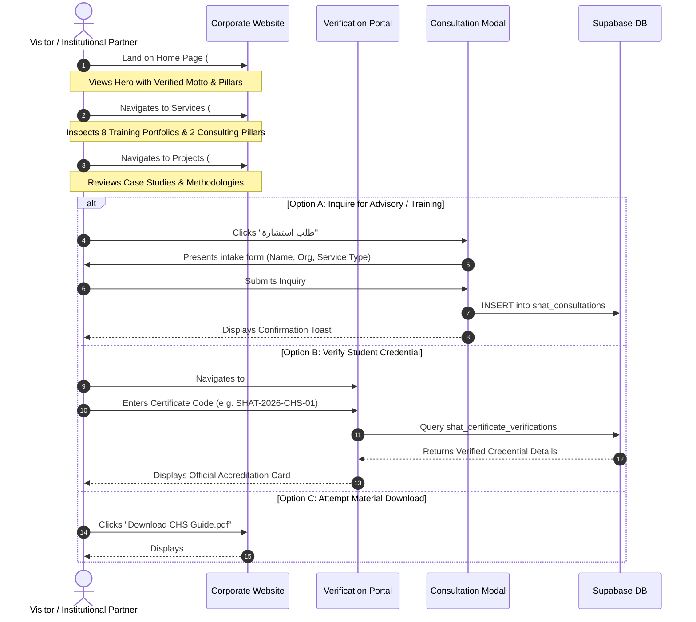
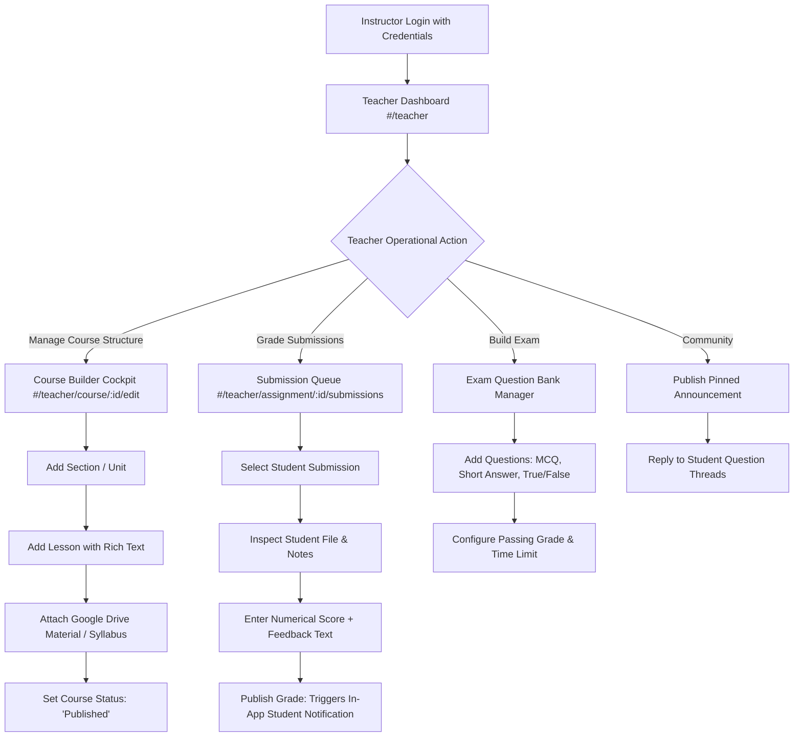
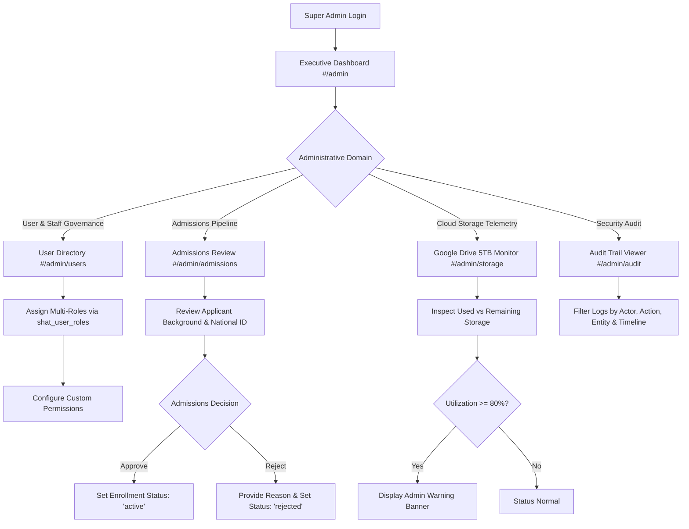

# SHAT Platform — Phase 2 User Journey Maps (UX Flows)
**شركة شات للتنمية والتطوير وأكاديمية شات**
*End-to-End User Experience Workflows Across All Operational Personas*
*Date: 2026-09-25 | Status: Complete & Frozen for Phase 2*

---

## 1. Visitor Persona Journey (رحلة الزائر غير المسجل)

* **Goal:** Understand SHAT's corporate capabilities, verify credibility via international standards (CHS, OECD DAC), review past projects, submit a consultation inquiry, or verify a certificate.



---

## 2. Student Persona Journey (رحلة الطالب والمتدرب)

* **Goal:** Register via WhatsApp OTP or Google, complete mandatory master profile (National ID), access enrolled courses, view lessons, download authorized materials, complete assignments, take timed exams, and inspect grades.

```mermaid
flowchart TD
    Start([Visitor wants to join Academy]) --> AuthChoice{Registration Method}
    
    AuthChoice -- WhatsApp OTP --> OtpReq[Enter Phone Number]
    OtpReq --> OtpSent[/api/auth/send-otp dispatches 6-digit code]
    OtpSent --> OtpInput[Enter Code & Verify]
    
    AuthChoice -- Google OAuth --> GoogleAuth[Continue with Google PKCE]
    
    OtpInput --> ProfileGate{First Time Registration?}
    GoogleAuth --> ProfileGate
    
    ProfileGate -- Yes --> ProfileWizard[Mandatory Profile Completion Wizard<br/>Arabic Name + English Name + National ID + Phone + DOB]
    ProfileWizard --> AtomicSave[Atomic Transaction: Supabase Auth + shat_profiles]
    
    ProfileGate -- No --> StudentDash[Student Dashboard #/academy]
    AtomicSave --> StudentDash
    
    StudentDash --> CourseSelect[Select Enrolled Course #/course/:id]
    CourseSelect --> RoomTabs{Select Room Tab}
    
    RoomTabs -- Lessons --> LessonViewer[Read Lesson & Stream Video]
    LessonViewer --> MarkDone[Mark Lesson Completed]
    
    RoomTabs -- Materials --> DriveDownload[Click Material Download]
    DriveDownload --> ProxyCheck{Serverless Proxy Validates RLS}
    ProxyCheck -- Active Enrollment --> StreamFile[Download from Google Drive 5TB]
    ProxyCheck -- Unauthorized --> Denied[403 Permission Guard]
    
    RoomTabs -- Assignments --> AssignTask[Read Instructions & Rubric]
    AssignTask --> UploadSol[Upload Solution File]
    UploadSol --> SubmitTask[Submit Task: Status changes to 'Submitted']
    
    RoomTabs -- Exams --> ExamStart[Review Time Limit & Start Quiz]
    ExamStart --> QuestionLoop[Answer Questions with Timer]
    QuestionLoop --> SubmitExam[Submit Exam: Immediate Objective Score]
    
    RoomTabs -- Gradebook --> GradeView[Inspect Personal Score, Weight & Feedback]
```

---

## 3. Teacher Persona Journey (رحلة المدرب المعتمد)

* **Goal:** Log into Teacher Portal, review pending student submissions, use Course Builder to structure lessons and materials, grade assignments with qualitative rubrics, and publish announcements.



---

## 4. Employee Persona Journey (رحلة الموظف الإداري ومسؤول المحتوى)

* **Goal:** Log into the Content Management System, draft articles or project case studies, preview them side-by-side in Desktop and Mobile layouts, and publish them to the official website.

```mermaid
flowchart TD
    EmpLogin[Staff Login] --> EmpDash[Employee Control Center #/admin/cms]
    Note over EmpDash: RBAC Enforces Content Scope Only<br/>Student Grades & Secrets are Strictly Hidden
    
    EmpDash --> NewPost[Click 'New Article / Post']
    NewPost --> RichEditor[Enter Title, Slug, Excerpt, Content & Cover Image]
    RichEditor --> SaveDraft[Save Draft: Status = 'draft' in shat_posts]
    
    SaveDraft --> TriggerPreview[Click 'Live Preview' Button]
    TriggerPreview --> ViewportModal[Launch Responsive Viewport Emulator]
    
    ViewportModal --> ViewDesktop[Inspect Desktop 1280px View]
    ViewportModal --> ViewMobile[Inspect Mobile 375px View]
    
    ViewMobile --> ApprovalCheck{Layout & Formatting Approved?}
    ApprovalCheck -- Needs Polish --> RichEditor
    ApprovalCheck -- Approved --> PublishAction[Click 'Publish Now']
    PublishAction --> DBCommit[Update shat_posts: Status = 'published']
    DBCommit --> LiveSite[Article Immediately Appears on Public Website #/posts]
    DBCommit --> AuditRecord[Immutable Record Appended to shat_audit_logs]
```

---

## 5. Super Admin Persona Journey (رحلة المدير العام وحوكمة المنصة)

* **Goal:** Complete operational oversight, manage staff roles and granular permissions, process course admission queues, monitor 5TB Google Drive utilization, and inspect the immutable audit trail.


