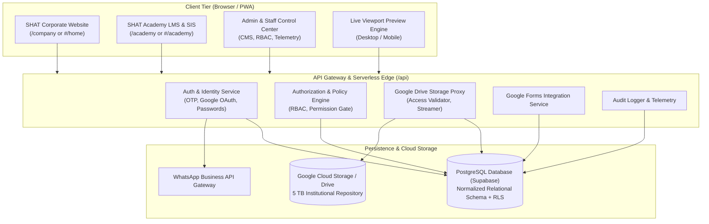
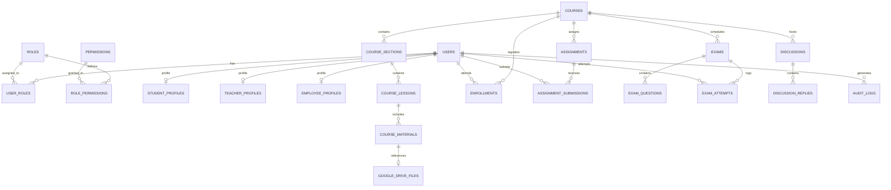
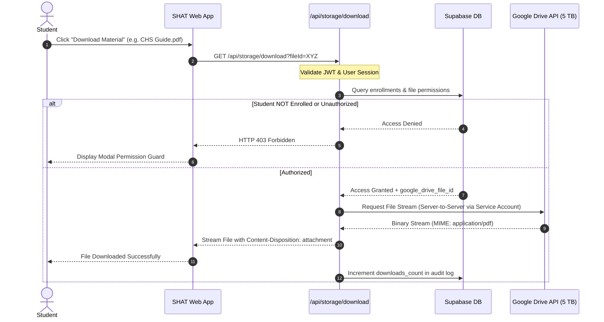

# SHAT Platform — Full System Architecture Proposal
**شركة شات للتنمية والتطوير وأكاديمية شات**
*Architecture Blueprint & Technical Design Document (TDD)*
*Version: 1.0.0 | Phase 0 Discovery & Planning*

---

## 1. High-Level Architectural Topology

The SHAT Platform is engineered as a decoupled, multi-tier web system structured into modular services, cleanly isolating the corporate web presence from the complex LMS/SIS academic operations while sharing a unified identity, security, and administrative governance fabric.



---

## 2. Directory Structure & Modular Decomposition

To eliminate the existing monolithic debt (`pages.js` 188KB, `translations.js` 254KB), the codebase will be refactored into cleanly decoupled domain packages:

```text
shat-company-platform/
├── api/                               # Serverless Backend Endpoints (Vercel / Node)
│   ├── auth/
│   │   ├── login.js                   # Credential verification & JWT issuance
│   │   ├── register.js                # Profile completion & national ID hashing
│   │   ├── send-otp.js                # WhatsApp OTP dispatch proxy
│   │   └── verify-otp.js              # OTP code verification
│   ├── storage/
│   │   ├── upload.js                  # Stream chunks to Google Drive with auth check
│   │   ├── download.js                # Validate enrollment & generate signed proxy stream
│   │   └── quota.js                   # Telemetry & 5 TB capacity calculation
│   ├── forms/
│   │   └── webhook.js                 # Google Forms submission receiver
│   └── audit/
│       └── log.js                     # Immutable audit logging
│
├── assets/
│   ├── css/
│   │   ├── variables.css              # Official brand tokens (#0F2E4A, #4B8834, typography)
│   │   ├── base.css                   # Reset, typography, accessibility resets
│   │   ├── components/                # Reusable UI components (buttons, modals, tables)
│   │   └── views/                     # View-specific stylesheets (home, course, admin)
│   │
│   └── js/
│       ├── core/                      # Application Kernel
│       │   ├── app.js                 # Bootstrapper & lifecycle manager
│       │   ├── router.js              # Hash/History router with route guards
│       │   └── i18n.js                # Lightweight bilingual engine (Arabic RTL / English)
│       │
│       ├── modules/                   # Domain Modules
│       │   ├── auth/                  # Authentication & Profile Completion
│       │   │   ├── authService.js
│       │   │   ├── rbac.js            # Permission checkers & role simulator
│       │   │   └── profileModal.js
│       │   │
│       │   ├── website/               # Corporate Website Views
│       │   │   ├── homeView.js
│       │   │   ├── aboutView.js
│       │   │   ├── servicesView.js
│       │   │   ├── projectsView.js
│       │   │   ├── postsView.js
│       │   │   └── contactView.js
│       │   │
│       │   ├── cms/                   # Corporate Content Management
│       │   │   ├── cmsManager.js
│       │   │   ├── previewEngine.js   # Side-by-side desktop/mobile preview
│       │   │   └── mediaLibrary.js    # Asset manager
│       │   │
│       │   ├── academy/               # Learning Management System
│       │   │   ├── studentDashboard.js
│       │   │   ├── teacherDashboard.js
│       │   │   ├── courseView.js
│       │   │   ├── assignmentManager.js
│       │   │   ├── examEngine.js
│       │   │   └── gradebook.js
│       │   │
│       │   └── integrations/          # 3rd Party Integrations
│       │       ├── googleDrive.js     # Storage proxy client
│       │       ├── googleForms.js     # Forms sync
│       │       └── whatsappOtp.js     # OTP client
│       │
│       └── shared/
│           ├── icons.js               # Clean SVG icon registry
│           ├── api.js                 # Central HTTP client with auth interceptors
│           └── storageStatus.js       # Integration connection indicators
│
├── docs/                              # Technical & User Documentation
├── supabase/                          # Database Migrations & Seed Scripts
│   ├── migrations/
│   │   └── 20260925_init_schema.sql
│   └── seeds/
│       └── demo_data.sql
└── vercel.json                        # Deployment rewrites & function routing
```

---

## 3. Database Schema Architecture (PostgreSQL / Supabase)

The relational architecture ensures referential integrity, strong typing, strict Row Level Security (RLS), and explicit domain separation.

### 3.1 Entity Relationship Diagram


### 3.2 Normalized Table Definitions

#### 1. Identity & Access Control
* **`users`**: `id (UUID PK)`, `email (UNIQUE)`, `username (UNIQUE - National ID)`, `password_hash`, `national_id_encrypted`, `full_name_ar`, `full_name_en`, `phone`, `whatsapp_phone`, `dob`, `avatar_url`, `status (active, suspended, pending_profile)`, `created_at`, `updated_at`.
* **`roles`**: `id (TEXT PK)`, `title_ar`, `title_en`, `description`.
* **`permissions`**: `id (TEXT PK)`, `category`, `description`.
* **`role_permissions`**: `role_id (FK)`, `permission_id (FK)` — Composite PK.
* **`user_roles`**: `user_id (FK)`, `role_id (FK)` — Composite PK.

#### 2. Academic Architecture
* **`courses`**: `id (UUID PK)`, `code (UNIQUE)`, `title_ar`, `title_en`, `track`, `category`, `instructor_id (FK users)`, `duration_weeks`, `credit_hours`, `overview`, `learning_outcomes (JSONB)`, `status (draft, active, archived)`, `created_at`.
* **`course_sections`**: `id (UUID PK)`, `course_id (FK courses)`, `title`, `sort_order`.
* **`course_lessons`**: `id (UUID PK)`, `section_id (FK course_sections)`, `title`, `content_rich_text`, `duration_minutes`, `sort_order`.
* **`course_materials`**: `id (UUID PK)`, `lesson_id (FK course_lessons)`, `course_id (FK courses)`, `title`, `file_type (PDF, DOCX, XLSX, VIDEO, LINK)`, `google_drive_file_id (FK google_drive_files)`, `download_count`.
* **`enrollments`**: `id (UUID PK)`, `course_id (FK courses)`, `student_id (FK users)`, `status (pending, approved, active, suspended, completed, withdrawn)`, `progress_pct`, `enrolled_at`, `approved_by (FK users)`.

#### 3. Assignments & Examination Engine
* **`assignments`**: `id (UUID PK)`, `course_id (FK courses)`, `title`, `instructions`, `deadline_at`, `max_grade`, `attachment_drive_file_id`, `created_by (FK users)`.
* **`assignment_submissions`**: `id (UUID PK)`, `assignment_id (FK assignments)`, `student_id (FK users)`, `submission_text`, `drive_file_id`, `submitted_at`, `status (submitted, late, graded, returned)`, `grade`, `feedback`, `graded_by (FK users)`, `graded_at`.
* **`exams`**: `id (UUID PK)`, `course_id (FK courses)`, `title`, `duration_minutes`, `start_window`, `end_window`, `max_attempts`, `passing_grade`, `created_by`.
* **`exam_questions`**: `id (UUID PK)`, `exam_id (FK exams)`, `question_type (mcq, true_false, short_answer, essay, file)`, `prompt`, `options (JSONB)`, `correct_answer_hash`, `points`, `sort_order`.
* **`exam_attempts`**: `id (UUID PK)`, `exam_id (FK exams)`, `student_id (FK users)`, `score`, `passed`, `started_at`, `submitted_at`.

#### 4. Google Drive Storage Integration Registry
* **`google_drive_files`**: `id (UUID PK)`, `google_drive_file_id (TEXT UNIQUE)`, `google_drive_folder_id`, `file_name`, `mime_type`, `file_size_bytes`, `md5_checksum`, `uploaded_by (FK users)`, `course_id (FK courses)`, `access_tier (public, student_enrolled, instructor_only, staff_only)`, `created_at`.

#### 5. Corporate CMS & Media Library
* **`posts`**: `id (UUID PK)`, `slug (UNIQUE)`, `title_ar`, `title_en`, `content_rich_text`, `excerpt`, `cover_image_url`, `category`, `tags (JSONB)`, `status (draft, preview, published, archived)`, `published_at`, `created_by`.
* **`projects`**: `id (UUID PK)`, `slug (UNIQUE)`, `title`, `client_name`, `category`, `timeline`, `description`, `outcomes (JSONB)`, `cover_image_url`, `gallery (JSONB)`, `status`.
* **`media_assets`**: `id (UUID PK)`, `file_name`, `storage_url`, `file_type`, `file_size_bytes`, `tags (JSONB)`, `uploaded_by`.

#### 6. Governance & System Operations
* **`audit_logs`**: `id (UUID PK)`, `actor_id (FK users)`, `actor_role`, `action_type`, `entity_type`, `entity_id`, `ip_address`, `user_agent`, `payload_before (JSONB)`, `payload_after (JSONB)`, `created_at`.
* **`system_settings`**: `key (TEXT PK)`, `value (JSONB)`, `updated_at`, `updated_by`.

---

## 4. Google Drive Integration Architecture (5 TB Tier)



### 4.1 Storage Telemetry Engine
* Daily cron or scheduled worker calls Google Drive `about.get` to calculate:
  * Total institutional quota: 5,497,558,138,880 bytes (5 TB)
  * Used bytes
  * Available bytes
  * Percentage utilized
* Storage Dashboard displays dynamic warning banners when thresholds exceed 70%, 80%, 90%, and 95%.

---

## 5. Security & Authentication Architecture

1. **Password Security:** Mandatory bcrypt (salt rounds = 12) or Argon2id on serverless backend.
2. **National ID Privacy Protocol:**
   * When registering, National ID is normalized and encrypted using AES-256-GCM before storage.
   * A salted cryptographic hash (HMAC-SHA256) is used for unique lookup without decrypting.
   * Public APIs and student roster views mask National ID completely.
3. **Session Management:** Secure HTTP-only cookies with `SameSite=Strict` and `Secure` flags in production; short-lived access tokens (15m) paired with refresh tokens.
4. **Brute Force Protection:** IP and username throttled via Redis/KV memory bucket: maximum 5 failed attempts per 15 minutes before temporary lockout.

---

## 6. Integration Status & Readiness Matrix

In compliance with Directive #57 ("No Fake Functionality"), all external systems are monitored by explicit status flags:

| Integration | Protocol | Status Code | Fallback / UI Behavior |
| :--- | :--- | :--- | :--- |
| **Supabase PostgreSQL** | HTTPS / PostgREST | `CONNECTED` (Needs Migration) | Runs queries via REST. Pending database schema execution. |
| **Google Drive (5 TB)** | Service Account v3 | `NOT_CONFIGURED` | UI displays "Storage Bridge Not Configured" with admin setup prompt. |
| **WhatsApp OTP** | Backend HTTP Gateway | `NOT_CONFIGURED` | UI displays configuration modal; logs to secure developer console in local mode. |
| **Google OAuth 2.0** | OAuth 2.0 PKCE | `NOT_CONFIGURED` | Google Sign-in button indicates pending client credentials. |
| **Google Forms** | Webhook / Embed | `READY` | Direct validated links or embedded IFrames with admin configuration. |

---

## 7. Execution Phasing Roadmap

* **Phase 1: Architecture & Database Hardening**
  * Deploy normalized schema to Supabase.
  * Establish RLS security policies for all tables.
* **Phase 2: Design System & UX Refactoring**
  * Break monolithic CSS and JS into modular components.
  * Implement WCAG AAA RTL/LTR design tokens.
* **Phase 3: Real Authentication & RBAC Engine**
  * Implement real password hashing, session tokens, and the first-time profile completion wizard.
* **Phase 4: Corporate Website & CMS**
  * Implement Home, About, Services, Projects, and Posts views with the verified content.
  * Build the Draft → Preview → Publish pipeline with Desktop/Mobile preview split.
* **Phase 5: Academy Core & LMS**
  * Build Student, Teacher, and Admin dashboards.
  * Develop Course Room, Lesson Viewer, Assignments, Exams, and Gradebook.
* **Phase 6: Integrations & Cloud Storage**
  * Wire backend proxies for Google Drive API and WhatsApp OTP gateway.
* **Phase 7: End-to-End Testing & Production Deployment**
  * Execute automated unit, integration, and security test suites.
  * Deploy to Vercel production.
